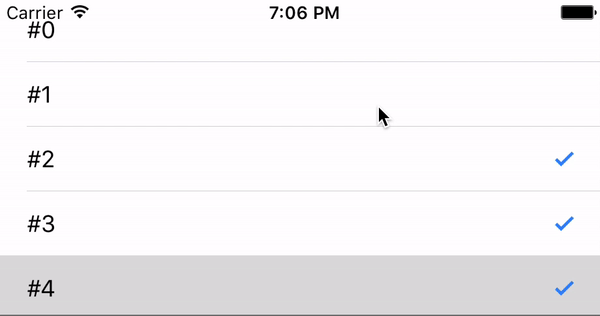

# LimitCellSelect
[](http://cocoapods.org/pods/LimitCellSelect)
[](https://github.com/Carthage/Carthage)
[](https://github.com/kaskay/LimitCellSelect/blob/master/LICENSE)
[](http://cocoapods.org/pods/LimitCellSelect)
[](https://developer.apple.com/swift/)

## Intoduction


You can specify the maximum number of cells that can be selected, and specify the cells that are selected by default.

## Requirements

`LimitCellSelect` is written in Swift 3. Compatible with iOS 9.0+

## Usage

#### import Library
```ruby
import LimitCellSelect
```

#### initial Limit and default select index
To limit the number of cell selections and preselect a cell
```ruby
limitCellSelect = LimitCellSelect.init(limit: 3, defaultIndex: [0,2])
```
or If you do not use defaultSelect
```ruby
limitCellSelect = LimitCellSelect.init(limit: 3)
```

## Installation

### Cocoapods

LimitCellSelect is available through [CocoaPods](http://cocoapods.org).

```ruby
pod 'LimitCellSelect'
```
### Carthage
LimitCellSelect is available through [Carthage](https://github.com/Carthage/Carthage).

```ruby
github "https://github.com/kaskay/LimitCellSelect"
```
## Author
[kaskay](https://github.com/kaskay)

## License
LimitCellSelect is available under the MIT license.
